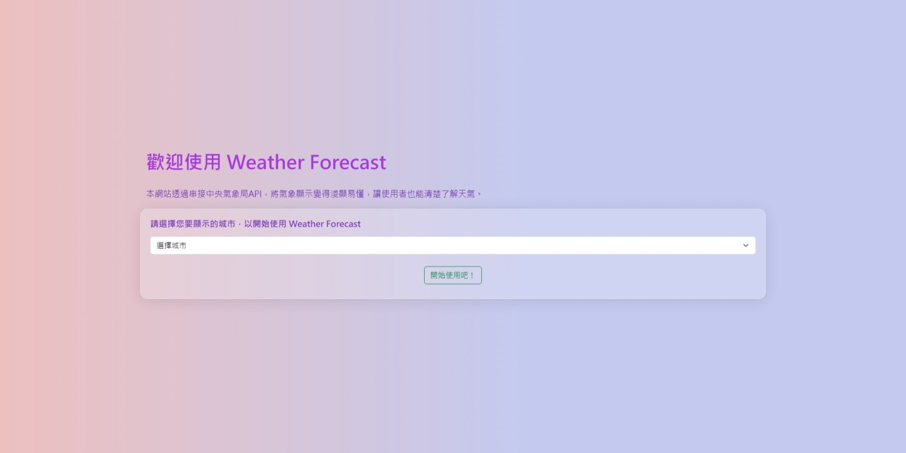
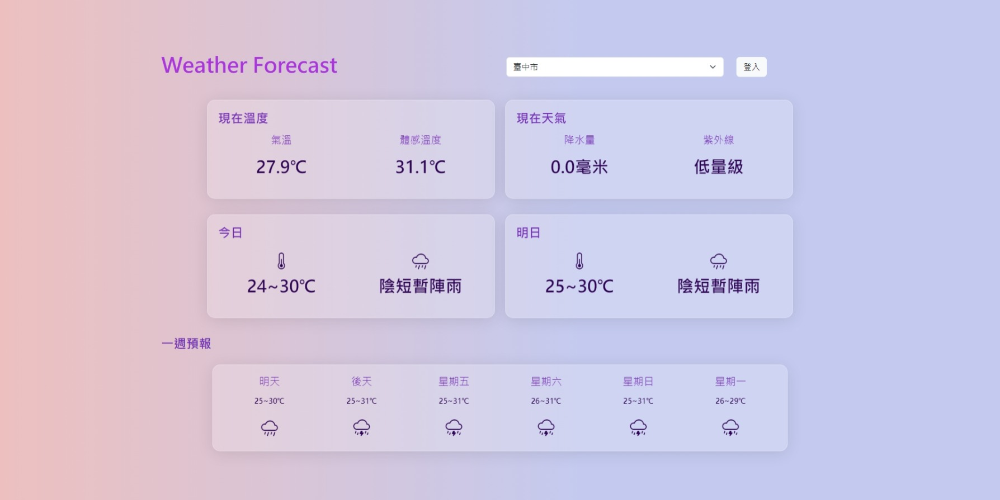
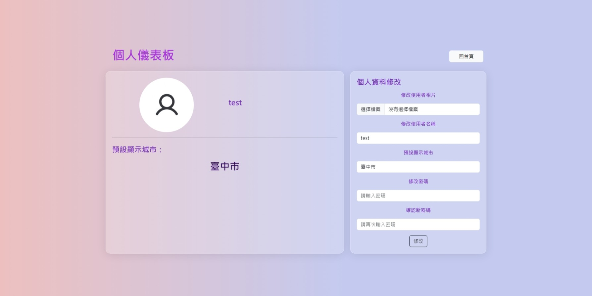
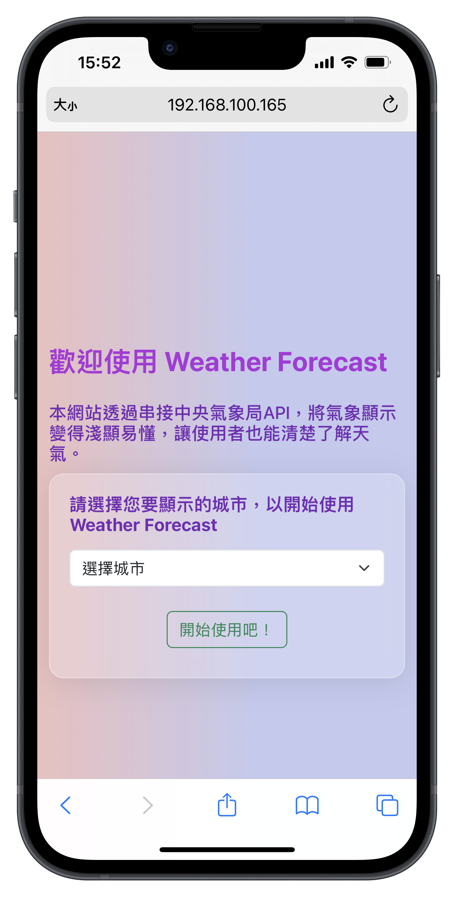
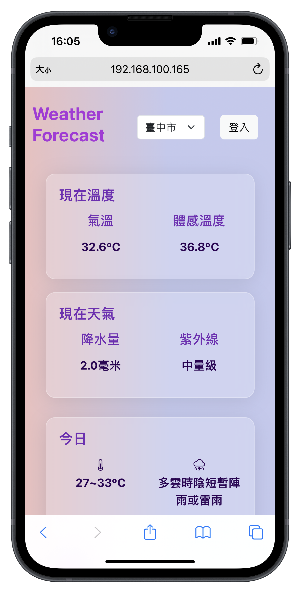
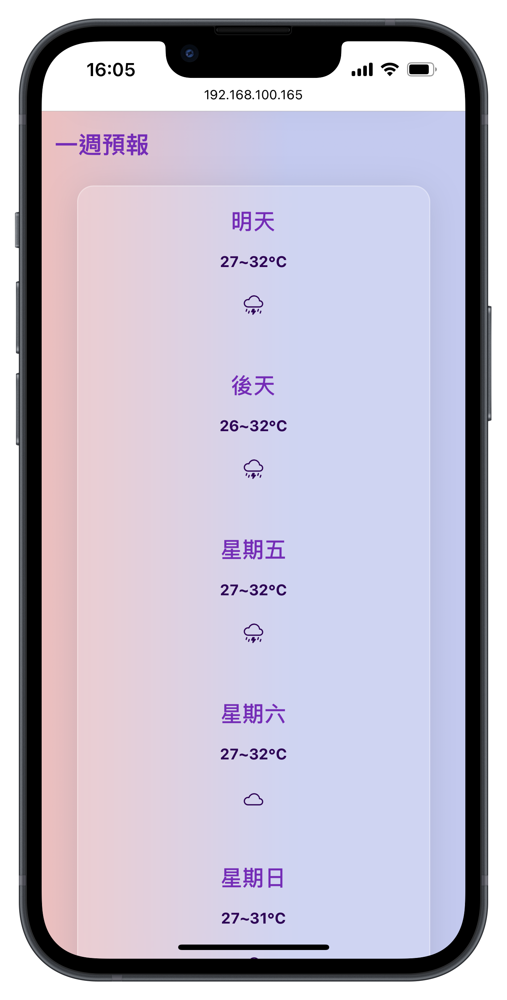
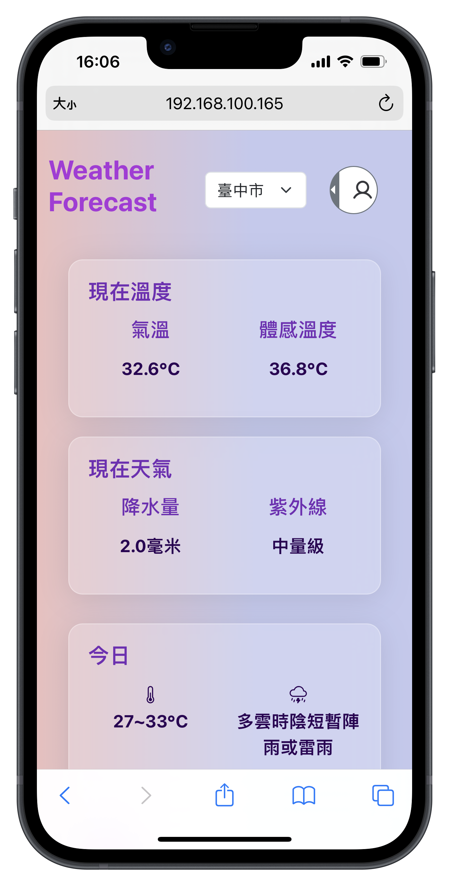

# Weather-Forecast-Website

## 初始化專案

### 1. 安裝依賴套件
    # Django
    pip install django

    # 串接 API
    pip install requests

    # 上傳圖片
    pip install pillow

### 2. 設定環境變數
新增檔案： weather_forecast/weather/env.py

env.py 的內容：

    cwa_apikey = "氣象開放平台的 apikey"

## 截圖

